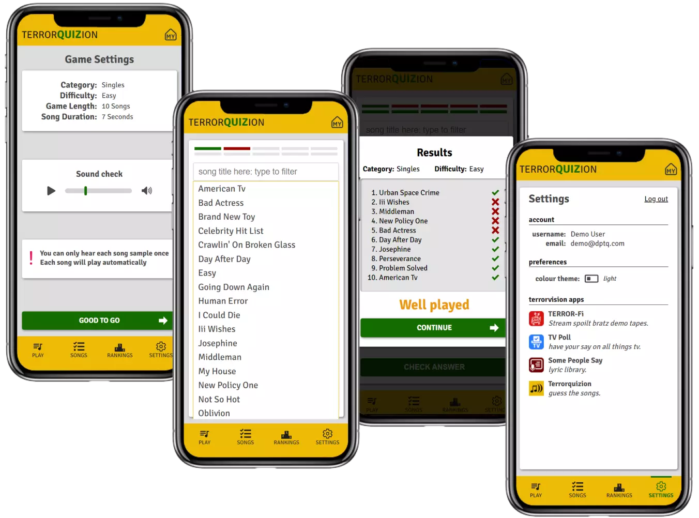

Project Link: [TERRORQUIZION](https://terrorvision-quiz.vercel.app)

# TERRORQUIZION

<!-- A little info about your project and/ or overview that explains **what** the project is about. -->

An app in which fans of the band Terrorvision can test their knowledge of Terrorvision songs based on short audio samples.

<!-- ## Game Details

Each player choses ten numbers (from available lotto numbers range). Mark off each of your numbers if the ball was drawn in the official lotto draw. The winner is the first person to match all ten numbers. -->

## Motivation

I wanted to continue learning the MERN stack so I decided to build this app . Ultimately helping me closer to my goal of building out full stack applications.

## Code

I used the MERN stack for this. In addition it includes custom hooks and functions.

## Future Features

- Add an additional quiz game so users can play multiple game types
- Progressive Web App
- Improved desktop layout design

## Available Scripts

In the project directory, you can run:

### `npm start`

Runs the app in the development mode.\
Open [http://localhost:3000](http://localhost:3000) to view it in your browser.

The page will reload when you make changes.\
You may also see any lint errors in the console.

<!--
### `npm test`

Launches the test runner in the interactive watch mode.\
See the section about [running tests](https://facebook.github.io/create-react-app/docs/running-tests) for more information. -->

### `npm run build`

Builds the app for production to the `build` folder.\
It correctly bundles React in production mode and optimizes the build for the best performance.

The build is minified and the filenames include the hashes.\
Your app is ready to be deployed!

<!-- ## Code Example

Show what the library does as concisely as possible, developers should be able to figure out **how** your project solves their problem by looking at the code example. Make sure the API you are showing off is obvious, and that your code is short and concise. -->

<!-- ## Installation

Provide step by step series of examples and explanations about how to get a development env running. -->

<!-- ## API Reference

Depending on the size of the project, if it is small and simple enough the reference docs can be added to the README. For medium size to larger projects it is important to at least provide a link to where the API reference docs live.

## Tests

Describe and show how to run the tests with code examples. -->

<!-- ## How to use? -->

## Contact

If you want to contact me you can reach me at [daveperry.tech](https://daveperry.tech)

<!-- [loopy lotto repo](https://github.com/your_username/repo_name) -->

## License

<!-- A short snippet describing the license (MIT, Apache etc) -->

Distributed under the MIT License. See [LICENSE.txt](LICENSE.txt) for more information.

<!-- MIT © [Dave Perry]() -->
